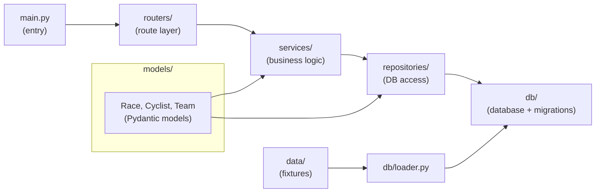
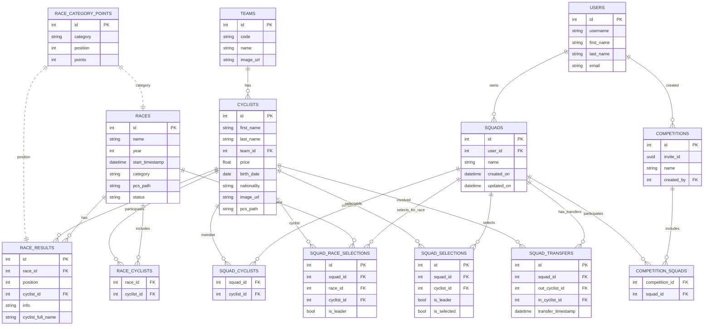

# cycling-manager

A small management tool for cycling races, teams and riders.

## Overview

This project stores simple models and repositories to manage cycling-related data (races, cyclists, teams) and provides sync tooling and routers for integration.

Core responsibilities:
- Define data models using `pydantic` (`models/`).
- Persist and load data via `db/` and repository helpers (`repositories/`).
- Provide sync operations in `services/` and HTTP-like routing in `routers/`.

## Project layout

- `main.py` — application entry point.
- `config.py` — configuration values.
- `data/` — sample JSON fixtures (`cyclists.json`, `points.json`, `races.json`).
- `db/` — database helpers, loader and migrations (Yoyo migrations present).
- `models/` — `Race`, `Cyclist`, `Team` and related Pydantic models.
- `repositories/` — repository abstractions for DB access.
- `routers/` — routing layer used by the application.
- `services/` — business logic and synchronization tasks.

## Architecture

## Database Schema

The diagram below shows the main tables and their relationships (based on `db/migrations`).

